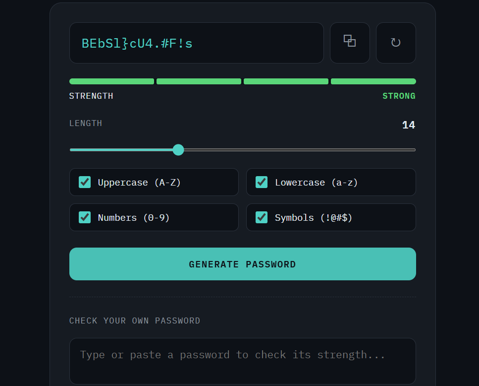

# Keyforge — Password Generator & Strength Checker

A simple, **no-database** password generator and strength checker built with plain HTML, CSS, and JavaScript. Runs entirely in the browser — no backend, no server, no setup required.

## Features

- **Password Generator**
  Generate a random password with a customizable length (6–32 characters) using a slider.

- **Character Type Toggles**
  Choose which character sets to include:
  - Uppercase letters (A–Z)
  - Lowercase letters (a–z)
  - Numbers (0–9)
  - Symbols (`!@#$%^&*` etc.)

- **Cryptographically Secure Randomness**
  Uses the browser's `crypto.getRandomValues()` API instead of `Math.random()` for stronger, less predictable password generation.

- **Copy to Clipboard**
  One-click copy with a small confirmation toast.

- **Strength Meter**
  A 4-segment strength bar (Weak / Fair / Good / Strong) that scores a password based on:
  - Length
  - Character variety (upper/lower/numbers/symbols)
  - Repeated-character patterns
  - Single-character-class passwords (e.g. only letters or only numbers)

- **Check Your Own Password**
  A separate input box lets you type or paste any password to see its strength and get specific improvement tips (e.g. "Add a number", "Avoid repeating the same character").

## How to run

No installation or server needed.

1. Open `index.html` directly in any modern browser.
2. Adjust length and character-type options, then click **Generate password**.
3. Use the **Check your own password** box to test any existing password.

> Note: Passwords are generated and checked entirely client-side in your browser. Nothing is sent anywhere or stored — this tool does not use `localStorage` since passwords are sensitive and shouldn't persist.

## 

- HTML5
- CSS3 (custom properties, no framework)
- Vanilla JavaScript (ES6+) — including the Web Crypto API (`crypto.getRandomValues`)
- Google Fonts (Space Grotesk, IBM Plex Mono) — loaded via CDN

## File structure

```
password-generator/
├── index.html   # Full app: markup, styles, and script in one file
└── README.md    # This file
```
screenshots:

## Possible extensions

- Passphrase mode (word-based, e.g. `correct-horse-battery-staple`)
- Exclude ambiguous characters option (e.g. `0` vs `O`, `1` vs `l`)
- Password history within the session (not persisted, for comparison)
- Estimated crack-time display alongside the strength meter
- Dark/light theme toggle
